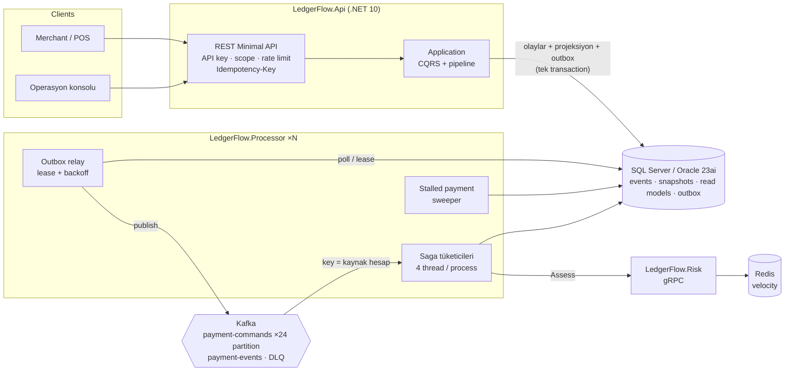
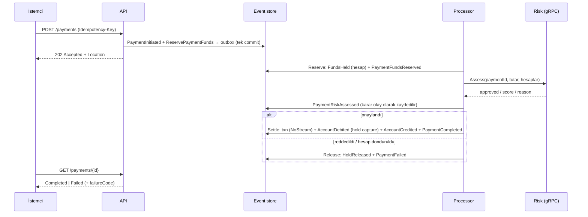

# LedgerFlow Payment Engine

[](https://github.com/Kayne-C/ledgerflow-payment-engine/actions/workflows/ci.yml)


**Event sourcing ile kurulmuş, çift taraflı kayıt (double-entry) tutan ödeme ve defter (ledger) motoru.**
Her kuruş değişmez bir olay olarak saklanır. Para, rezerve → risk → mutabakat (settle) adımlarından oluşan bir saga ile
taşınır. Sistem, çökme, ağ kesintisi ve tekrarlanan istekler altında bile **bir ödemeyi tam olarak bir kez** uygular ve
defteri kuruşu kuruşuna denk tutar.

> Ödeme sistemlerinde asıl zor olan "hızlı" olmak değil; süreç ortasında ölen bir pod'dan, iki kez gönderilen bir
> istekten veya bir saat kapalı kalan bir risk servisinden sonra **hiçbir paranın kaybolmamasını ya da iki kez
> düşülmemesini** garanti etmektir. LedgerFlow bu garantileri kodla, testlerle ve kaos tatbikatıyla gösterir.

---

## İçindekiler

- [Öne çıkanlar](#öne-çıkanlar)
- [Mimari](#mimari)
- [Doğruluk garantileri](#doğruluk-garantileri)
- [Hızlı başlangıç](#hızlı-başlangıç)
- [API turu](#api-turu)
- [Testler](#testler)
- [Ölçümler ve kaos tatbikatı](#ölçümler-ve-kaos-tatbikatı)
- [Proje yapısı](#proje-yapısı)
- [Yol haritası](#yol-haritası)

## Öne çıkanlar

| Alan | Uygulama |
|---|---|
| **Event sourcing** | Kendi event store'umuz, SQL Server / Oracle üzerinde: `(StreamId, StreamVersion)` unique index ile **optimistic concurrency**, birden çok stream'e **atomik commit**, her 25 olayda bir snapshot, geçmiş bir ana göre durum (`balance-at`). |
| **Çift taraflı kayıt** | Her işlem (`txn-{id}`) borç = alacak kuralını domain'de zorlar. Tutarlar `long` minor unit'tir (kuruş), `decimal`/`double` yuvarlaması yoktur. Para birimi başına bir clearing hesabı vardır, deneme bilançosu (trial balance) her an sıfıra denktir. |
| **Tam olarak bir kez mutabakat** | İşlem stream'i *"stream yok"* beklentisiyle açılır. Aynı ödeme iki kez mutabakata girmeye çalışırsa ikinci commit veritabanı seviyesinde reddedilir, iki yarış arasından tek kazanan çıkar. |
| **Saga + bloke (hold)** | Orkestrasyonlu saga akışı: `Reserve (hold)` → `Risk (gRPC)` → `Settle` (4 stream tek transaction'da) ya da telafi adımı `Release`. Her adım durum makinesi sayesinde idempotent'tir. Takılan adımları bir **sweeper** yeniden yürütür, terk edilen ödemeleri zaman aşımına düşürür. |
| **İdempotency** | Para hareketlerinde `Idempotency-Key` zorunludur. Kimlikler SHA-256 tabanlı ve deterministiktir (istemci + anahtar), ayrıca bir istek parmak izi tutulur. Aynı istek tekrar gelirse orijinal sonuç döner (`Idempotent-Replayed: true`). Aynı anahtar farklı gövdeyle gelirse **422** döner. |
| **Kurcalamaya karşı iz (tamper evidence)** | Her stream bir **SHA-256 hash zinciri** taşır. Veritabanında elle değiştirilen tek bir olay bile `/admin/streams/{id}/integrity` ile tespit edilir. |
| **Mesajlaşma** | Transactional outbox kullanılır. Birden çok relay, lease ile id aralığı talep eder; her satır bir kez yayımlanır ve hata halinde üstel geri çekilmeyle (exponential backoff) yeniden denenir. Kafka tarafında idempotent producer, `acks=all` ve **kaynak hesaba göre partition anahtarı** (hesap başına tek yazıcı) kullanılır. 5 başarısız denemeden sonra mesaj **DLQ**'ya düşer. |
| **Risk servisi** | Ayrı bir ASP.NET Core **gRPC** servisi: kara liste, tutar eşikleri, Redis sorted set ile hız (velocity) kuralı. İstemci tarafında Polly v8 standart dayanıklılık hattı (deneme başına zaman aşımı, retry, circuit breaker) vardır. Servis kapalıysa hiçbir ödeme varsayılan olarak onaylanmaz (*fail-closed*). |
| **Mutabakat (reconciliation)** | `/admin/reconciliation` şunları kontrol eder: deneme bilançosu, hesap bakiyesi ile yevmiye kayıtlarının toplamı, negatif bakiyeye düşen müşteri hesabı, blokelerin süreçteki ödemelerle eşleşmesi. |
| **Güvenlik** | API anahtarları SHA-256 hash olarak saklanır ve sabit zamanlı (constant-time) karşılaştırılır. `payments` / `admin` scope'ları, istemci başına token-bucket rate limiting ve RFC 9457 ProblemDetails (makine tarafından okunabilir hata kodu) kullanılır. |
| **SQL Server ayarı** | `OPTIMIZE_FOR_SEQUENTIAL_KEY`, `READ_COMMITTED_SNAPSHOT` ve `AUTO_UPDATE_STATISTICS_ASYNC` ayrı bir migration ile gelir. Ölçümle bulunan son sayfa latch çekişmesi (last-page insert contention) **187 sn → 13 sn**'ye düştü (ayrıntı: [benchmarks](docs/benchmarks.md)). |
| **Gözlemlenebilirlik** | OpenTelemetry trace/metric/log verisi **Aspire Dashboard**'a akar. Trace context outbox ve Kafka üzerinden taşınır: API isteği → Kafka → Processor → gRPC risk çağrısı tek trace'te görünür. |
| **Çalıştırma** | Chiseled (distroless, non-root) container'lar, tek seferlik `migrator`, 2 replikalı processor, KRaft modunda Kafka ve GitHub Actions CI kullanılır. |

## Mimari



Bir ödemenin yolculuğu:



Ayrıntılar: [docs/architecture.md](docs/architecture.md) · Kararlar: [docs/adr](docs/adr)

## Doğruluk garantileri

| Garanti | Nasıl sağlanıyor | Hangi test kanıtlıyor |
|---|---|---|
| Bir ödeme en fazla **bir kez** mutabakata girer | `txn-{paymentId}` stream'i `NoStream` ile açılır, unique index ikinci yazıyı reddeder | `Concurrent_appends_at_the_same_expected_version_have_exactly_one_winner` (gerçek SQL Server) |
| Commit ya hep ya hiç | 4 stream + projeksiyonlar + outbox tek `SaveChanges` transaction'ında | `A_conflict_on_one_stream_rolls_back_every_stream_and_message_of_the_commit` |
| Müşteri hesabı eksiye düşmez | Bloke ve borç `available` bakiyesine karşı domain'de kontrol edilir, yarışlar optimistic concurrency ile çözülür | `Parallel_reservations_against_one_account_never_overdraw_it` |
| Tekrarlanan istek ikinci ödeme yaratmaz | Deterministik id + parmak izi, yarışta kaybeden kazananın sonucunu döner | `Concurrent_retries_of_one_request_create_a_single_payment` |
| Outbox satırı bir kez yayımlanır | Lease ile id aralığı talep etme (`ExecuteUpdate`) | `Concurrent_outbox_relays_publish_every_row_exactly_once` |
| Risk servisi çökerse para kaybolmaz | Bloke devam eder, adım yeniden denenir, sweeper yeniden yürütür | `A_risk_engine_outage_keeps_funds_reserved_and_the_saga_resumes_after_recovery` |
| Geçmiş değiştirilemez | Stream başına hash zinciri | `Editing_a_stored_event_is_detected_by_the_hash_chain` |
| Defter her an denk | Borç = alacak, clearing hesapları, mutabakat raporu | `Hundreds_of_random_payments_leave_the_ledger_reconciled` + kaos tatbikatı |

## Hızlı başlangıç

**Gereksinimler:** .NET 10 SDK. (Tam topoloji için Docker.)

### 1) Sıfır bağımlılık: SQLite + in-process mesajlaşma

```bash
dotnet run --project src/LedgerFlow.Api
# Scalar UI:  http://localhost:5090/scalar
# OpenAPI:    http://localhost:5090/openapi/v1.json
```

İlk açılışta üç demo TRY hesabı açılır: **Alice Yılmaz** (25.000 ₺), **Bora Kaya** (5.000 ₺) ve
**Kapadokya Market Ltd.** (0 ₺). Bu modda risk kontrolü her şeyi onaylar, saga aynı process içinde çalışır.

| İstemci | API anahtarı (yalnızca geliştirme) | Scope |
|---|---|---|
| `demo-merchant` | `lf_demo_merchant_7f3a9c2e5b` | `payments` |
| `ops-console` | `lf_demo_ops_4d8e1b6a0c` | `payments`, `admin` |

> Konfigürasyonda anahtarın kendisi değil yalnızca SHA-256 hash'i durur. Üretimde bu hash'ler secret store'dan gelir.

### 2) Tam dağıtık topoloji: SQL Server + Kafka + Redis + Risk + 2 Processor + Aspire Dashboard

```bash
docker compose up --build
# API:              http://localhost:8090/scalar
# Aspire Dashboard: http://localhost:18888   (trace / metric / log)
# Kafka (host):     localhost:29092
```

### 3) Aynı stack, Oracle Database 23ai Free üzerinde

```bash
docker compose -f docker-compose.yml -f docker-compose.oracle.yml up --build
```

## API turu

```bash
KEY=lf_demo_ops_4d8e1b6a0c; API=http://localhost:5090/api/v1

# İki hesap aç ve birini fonla (para hareketlerinde Idempotency-Key zorunlu)
A=$(curl -s -X POST $API/accounts -H "X-Api-Key: $KEY" -H 'content-type: application/json' \
  -d '{"holder":"Deniz Arslan","currency":"TRY"}' | jq -r .accountId)
B=$(curl -s -X POST $API/accounts -H "X-Api-Key: $KEY" -H 'content-type: application/json' \
  -d '{"holder":"Ege Kahve Ltd.","currency":"TRY"}' | jq -r .accountId)
curl -s -X POST $API/accounts/$A/deposits -H "X-Api-Key: $KEY" -H 'Idempotency-Key: dep-001' \
  -H 'content-type: application/json' -d '{"amount":1500.00,"currency":"TRY"}' | jq

# Ödeme: 202 Accepted, saga arka planda ilerler
PAY=$(curl -s -X POST $API/payments -H "X-Api-Key: $KEY" -H 'Idempotency-Key: order-42' \
  -H 'content-type: application/json' \
  -d "{\"fromAccountId\":\"$A\",\"toAccountId\":\"$B\",\"amount\":249.90,\"currency\":\"TRY\",\"reference\":\"Sipariş #42\"}")
echo $PAY | jq

# Aynı isteği tekrar gönder: aynı ödeme döner, başlıkta "Idempotent-Replayed: true"
# Aynı anahtar + farklı tutar: 422 Idempotency.KeyReused

curl -s $API/payments/$(echo $PAY | jq -r .paymentId) -H "X-Api-Key: $KEY" | jq   # Completed
curl -s "$API/accounts/$A/statement" -H "X-Api-Key: $KEY" | jq                   # hesap ekstresi
curl -s "$API/accounts/$A/balance-at?at=2026-10-06T09:00:00Z" -H "X-Api-Key: $KEY" | jq  # geçmişteki bakiye

# Operasyon
curl -s $API/admin/trial-balance  -H "X-Api-Key: $KEY" | jq   # net = 0
curl -s $API/admin/reconciliation -H "X-Api-Key: $KEY" | jq   # isClean: true
curl -s $API/admin/streams/account-${A//-/}/integrity -H "X-Api-Key: $KEY" | jq   # hash zinciri
```

| Uç nokta | Açıklama |
|---|---|
| `POST /api/v1/accounts` · `GET …/{id}` | Hesap aç / bakiye (`balance`, `held`, `available`) |
| `GET …/{id}/statement` · `GET …/{id}/balance-at?at=` | Sayfalı ekstre / geçmiş bir andaki bakiye (snapshot + olay replay) |
| `POST …/{id}/deposits` · `POST …/{id}/withdrawals` | Clearing hesabına karşı çift kayıtlı para giriş/çıkışı (idempotent) |
| `POST /api/v1/payments` · `GET …/{id}` | Ödeme başlat (202) / durum ve hata kodu |
| `GET /api/v1/admin/trial-balance` | Para birimi başına müşteri ve clearing toplamları |
| `GET /api/v1/admin/reconciliation` | Tüm defter tutarlılık raporu |
| `GET /api/v1/admin/streams/{streamId}/integrity` | Hash zinciri doğrulaması |
| `GET /api/v1/admin/stats` · `POST …/accounts/{id}/freeze` | Olay/outbox istatistikleri / hesap dondurma |
| `GET /health/live` · `GET /health/ready` | Liveness / readiness (DB, Kafka) |

## Testler

```bash
dotnet test --solution LedgerFlow.slnx
```

**65 test.** Hepsi her CI koşusunda çalışır, SQL Server testleri de dahil (Testcontainers):

| Proje | Kapsam |
|---|---|
| `Domain.UnitTests` (27) | Minor unit para, fazla ondalığın yuvarlanmadan reddedilmesi, bloke/capture/release, clearing hesapları, saga durum makinesi, borç = alacak, snapshot ↔ replay eşitliği, deterministik id ve hash zinciri |
| `Infrastructure.IntegrationTests` (9) | **Gerçek SQL Server 2022** üzerinde: aynı versiyona eşzamanlı yazımda tek kazanan, çoklu stream'de geri alma, eşzamanlı blokelerde eksiye düşmeme, eşzamanlı tekrarlarda tek ödeme, iki relay ile outbox'ta tek yayın, hash zinciri ile kurcalama tespiti, geçmiş bakiye |
| `Api.IntegrationTests` (17) | `WebApplicationFactory` ile uçtan uca: saga mutlu yol, yetersiz bakiye, risk reddi ve telafi, süreç ortasında dondurulan hedef hesap, risk servisi kesintisi ve toparlanma, sweeper, idempotency (tekrar, 422, istemci kapsamı), scope'lar, ProblemDetails, yüzlerce rastgele ödemeden sonra mutabakat |
| `Risk.Tests` (5) | Kural motoru ve gerçek gRPC sunucusu: eşikler, kara liste, retry'ların hız sayacını şişirmemesi, girdi doğrulama |
| `ArchitectureTests` (7) | Katman bağımlılıkları, Application'ın transport/DB bilmemesi, aggregate'lerin yalnızca olaylarla durum değiştirmesi, olayların immutable sealed record olması, her request'e tek `internal sealed` handler |

Docker yoksa SQL Server testleri başarısız sayılmaz, atlanır. Ek olarak:

- `tests/load/payments.js`: k6 sabit varış hızı (constant-arrival-rate) senaryosu.
- `tests/load/measure-e2e.sh`: uçtan uca saga gecikmesi ve verimi (throughput).
- `tests/chaos/chaos-drill.sh`: yük altında processor SIGKILL, risk kesintisi ve Kafka restart.

## Ölçümler ve kaos tatbikatı

Tüm topoloji (API, 2 processor, risk, SQL Server 2022, Kafka, Redis, Aspire) **tek bir 4 vCPU VM üzerinde Docker'da**
çalışırken k6 ile ölçüldü. Bu bir kapasite iddiası değil, tekrar üretilebilir bir taban çizgisidir. Darboğaz CPU'dur, çünkü
veritabanı, broker ve servisler aynı 4 çekirdeği paylaşıyor. Ayrıntı ve tekrar üretme adımları:
[docs/benchmarks.md](docs/benchmarks.md).

**Uçtan uca saga** (API → Kafka → reserve → gRPC risk → settle, her ödeme 4 stream'e yazar):

| Sabit yük | Uçtan uca verim | Saga gecikmesi p50 / p95 / p99 | API p95 (202) | Mutabakat |
|---|---|---|---|---|
| 40 ödeme/sn | 39,9 ödeme/sn | **120 / 212 / 278 ms** | 28,6 ms | temiz |
| 60 ödeme/sn | 59,9 ödeme/sn | 252 / 3.180 / 4.474 ms | 61 ms | temiz |
| 70 ödeme/sn | doyum (makine CPU sınırında) | — | — | — |

**Kaos tatbikatı** (30 ödeme/sn, 100 sn, 200 hesap). Yük sürerken sırayla: bir processor **SIGKILL** ile öldürülür,
risk servisi **20 sn kapatılır**, processor geri gelir, **Kafka yeniden başlatılır**.

| Ölçüt | Sonuç |
|---|---|
| HTTP hata oranı | **%0** (3.401 istek) |
| Ödeme sonucu | **3.001 / 3.001 Completed**, 0 Failed |
| Çift mutabakat | **0** |
| DLQ'ya düşen saga komutu | 31 (risk kesintisi sırasında). **Hepsi sweeper tarafından yeniden yürütüldü.** |
| Yük bittikten sonra süreçte kalan ödeme | 85 sn içinde **0** |
| Mutabakat | **temiz**: 654 hesap, 24.900 yevmiye satırı, deneme bilançosu net **0** |

## Proje yapısı

```text
protos/risk.proto                     gRPC sözleşmesi (Api/Processor istemci, Risk sunucu)
src/
  LedgerFlow.Domain/                  Account, Payment, LedgerTransaction aggregate'leri, Money, hash zinciri (bağımlılıksız)
  LedgerFlow.Application/             CQRS use case'leri, saga adımları, mutabakat, port'lar, pipeline behavior'lar
  LedgerFlow.Infrastructure/          EF Core 10 event store, projeksiyonlar, snapshot, outbox relay, Kafka, gRPC istemci
  LedgerFlow.Migrations.SqlServer/    SQL Server migration'ları (+ sequential key / RCSI ayarı)
  LedgerFlow.Migrations.Oracle/       Oracle 23ai migration'ları
  LedgerFlow.Api/                     Minimal API, API key auth, idempotency, rate limiting, ProblemDetails, OpenAPI/Scalar
  LedgerFlow.Processor/               Outbox relay + Kafka saga tüketicileri + sweeper (worker)
  LedgerFlow.Risk/                    gRPC risk motoru (Redis velocity)
tests/
  LedgerFlow.*.Tests / IntegrationTests / ArchitectureTests
  load/                               k6 yük testleri ve uçtan uca ölçüm
  chaos/                              kaos tatbikatı
docs/                                 Mimari, ADR'ler, ölçümler
```

## Yol haritası

- [ ] Çoklu para birimi ödemeleri: FX kuru olay olarak kaydedilir, iki clearing hesabı üzerinden çevrim yapılır
- [ ] Event store'un aylık partition'lara ayrılması ve soğuk olayların arşivlenmesi
- [ ] Polling relay'e alternatif olarak Debezium CDC ile outbox yayını
- [ ] Gün sonu (EOD) kapanışı ve imzalı mutabakat raporu
- [ ] Helm chart + KEDA ile Kafka consumer lag'e göre processor ölçekleme
- [ ] Ayrı makinelerde (DB / broker / servis) kapasite ölçümü
