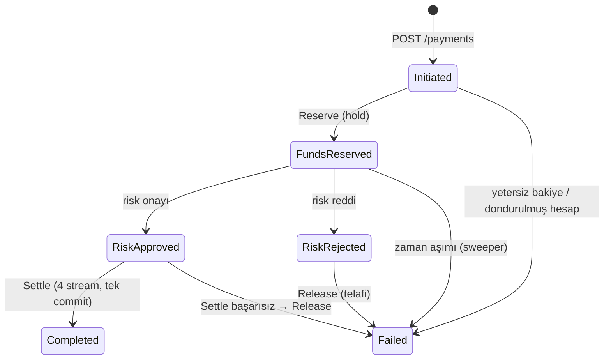

# Mimari

Bu belge LedgerFlow'un nasıl çalıştığını, hangi garantiyi hangi mekanizmanın sağladığını ve bilinçli olarak kabul
edilen ödünleşimleri (trade-off) anlatır. Kararların gerekçeleri [adr/](adr) altındadır.

## 1. Katmanlar

```text
Domain  ◀── Application  ◀── Infrastructure  ◀── Api / Processor
                                              (Risk ayrı servis; yalnızca protos/risk.proto paylaşılır)
```

| Katman | Sorumluluk | Bilmediği şeyler |
|---|---|---|
| **Domain** | `Account`, `Payment`, `LedgerTransaction` aggregate'leri; `Money` / `Currency`; deterministik id ve hash zinciri | EF Core, Kafka, HTTP, zaman kaynağı |
| **Application** | Komut/sorgu handler'ları, saga adımları, mutabakat, port'lar (`ILedgerSession`, `ILedgerReadStore`, `IRiskAssessor`) | Hangi veritabanı ve transport'un kullanıldığı |
| **Infrastructure** | Event store, projeksiyonlar, snapshot, outbox relay, Kafka, gRPC istemcisi, sweeper | HTTP host'u |
| **Api / Processor** | Host'lar: HTTP uçları, kimlik doğrulama, rate limiting / arka plan servisleri | İş kuralları |

Kurallar `LedgerFlow.ArchitectureTests` ile CI'da zorlanır (örn. Application, `Confluent.Kafka` veya
`Microsoft.EntityFrameworkCore.SqlServer`'a referans veremez. Aggregate'lerin public setter'ı olamaz).

İstek hattı, ~60 satırlık bir in-house mediator'dır: `Sender` → `ValidationBehavior` (FluentValidation) →
`RequestTelemetryBehavior` → handler. Hatalar exception değil, `Result<T>` / `Error` olarak döner ve API'de RFC 9457
ProblemDetails'e (`code` alanıyla) çevrilir.

## 2. Event store

Ayrı bir event store ürünü yerine olaylar ilişkisel veritabanında tutulur ([ADR-0001](adr/0001-event-store-on-relational-database.md)).

| Tablo | İçerik |
|---|---|
| `Events` | `GlobalPosition` (identity, global sıra) · `StreamId` · `StreamVersion` · `EventId` · `EventType` · `Payload` (JSON) · `PreviousHash` · `Hash` · `RecordedAtUtc` · `TraceParent` |
| `Snapshots` | `(StreamId, Version)` PK · durum JSON'u · o andaki zincir hash'i |
| `Outbox` | Yayımlanacak mesajlar (`Topic`, `PartitionKey`, `Payload`, `TraceParent`) + lease alanları (`LeaseId`, `LeaseExpiresUtc`, `Attempts`, `LastError`, `ProcessedOnUtc`) |
| `AccountView`, `PaymentView`, `LedgerEntries` | Inline projeksiyonlar (read model) |

**Optimistic concurrency.** `(StreamId, StreamVersion)` üzerinde unique index vardır. Bir aggregate, okunduğu versiyonun
devamına yazar. Başka biri araya girdiyse insert unique index'e çarpar ve `ConcurrencyConflictException`'a çevrilir.
Hata kodları sağlayıcıya özeldir: SQL Server 2601/2627 (ve 1205 deadlock kurbanı), Oracle ORA-00001/00060, SQLite
19/2067/1555. Handler'lar `Optimistic.RetryAsync` ile durumu yeniden yükleyip tekrar dener: 15 deneme, üstel geri çekilme
+ full jitter. Retry'lar kör değildir. Her denemede iş kuralları güncel duruma karşı yeniden işletilir, bu yüzden
"yetersiz bakiye" gibi sonuçlar doğru kalır.

**Atomik commit.** `ILedgerSession`, birden çok aggregate'i (`Track`) ve mesajı (`Publish`) toplayıp tek `SaveChanges`
çağrısında yazar: olaylar, projeksiyon güncellemeleri, snapshot'lar ve outbox satırları. Ödemenin mutabakatı 4 stream'e
dokunur (işlem, kaynak hesap, hedef hesap, ödeme). Biri çakışırsa hiçbiri yazılmaz. Stream'ler `StreamId`'ye göre sıralı
yazıldığı için iki commit birbirini ters sırada kilitleyip deadlock üretmez.

**"Stream yok" beklentisi.** `LedgerTransaction` stream'i (`txn-{paymentId}`) yalnızca daha önce hiç yoksa yazılabilir
(beklenen versiyon = -1). Aynı ödeme için iki mutabakat yarışırsa unique index ikincisini reddeder. Bu, "tam olarak bir
kez mutabakat" garantisinin veritabanı seviyesindeki karşılığıdır, uygulama koduna güvenmez.

**Hash zinciri.** Her olayın `Hash` değeri şöyle hesaplanır:
`SHA-256(PreviousHash ⏎ StreamId ⏎ StreamVersion ⏎ EventType ⏎ Payload)`. Ardından `IEventStoreAudit` stream'i baştan
sona okuyup zinciri yeniden hesaplar. Herhangi bir olayın tutarını elle değiştirmek, o olaydan itibaren zinciri kırar.
Bu bir kriptografik imza değildir (DB'ye tam erişimi olan biri zinciri baştan yazabilir). Amacı, kazara veya tek satırlık
müdahaleleri görünür kılmaktır. İmzalı gün sonu kökü yol haritasındadır.

**Snapshot ve geçmiş sorgular.** Her 25 olayda bir (ayarlanabilir) snapshot alınır. Bir aggregate şu sırayla yüklenir:
süreç içi önbellek → en yeni snapshot → sonraki olaylar. `balance-at?at=` ise o andan önceki en yeni snapshot'ı ve o ana
kadarki olayları kullanır. Testler, snapshot'tan yüklenen durumun tam replay ile birebir aynı olduğunu doğrular.

**Hesap önbelleği.** Sık kullanılan hesapların son commit edilmiş durumu süreç içi bir `MemoryCache`'te tutulur (50.000
hesap). Önbellek yalnızca bir hızlandırıcıdır, doğruluk kaynağı değildir. Bayat bir durumdan yapılan yazma zaten
optimistic concurrency'ye takılır. Önbellek de daha yeni bir versiyonu asla eskisiyle değiştirmez.

## 3. Çift taraflı defter

- Tutarlar `long` **minor unit**'tir (TRY/USD/EUR/GBP için kuruş/cent, JPY için 0 ondalık). `Money.FromMajor`, para
  biriminin izin verdiğinden fazla ondalığı **reddeder, yuvarlamaz**.
- Her para hareketi bir `LedgerTransaction`'dır. En az iki bacağı vardır, tüm tutarlar pozitiftir ve borçlar alacaklara
  eşittir. Bu kural domain'de zorlanır, ihlal eden işlem oluşturulamaz.
- Dış dünyayla para alışverişi (para yatırma/çekme), para birimi başına bir **clearing hesabı** üzerinden yapılır. Müşteri
  hesapları eksiye düşemez. Clearing hesapları düşebilir (sisteme giren paranın aynasıdır).
- Bu yüzden her para birimi için `Σ müşteri bakiyeleri + Σ clearing bakiyeleri = 0` olmalıdır.
  `/admin/trial-balance` bunu, `/admin/reconciliation` ise ayrıntısını raporlar:
  1. deneme bilançosu sıfır mı,
  2. her hesabın bakiyesi yevmiye kayıtlarının toplamına eşit mi,
  3. negatif bakiyeli müşteri hesabı var mı,
  4. her hesaptaki bloke toplamı, o hesaptan süreçte olan ödemelerin toplamına eşit mi.

## 4. Ödeme saga'sı

Orkestrasyonlu saga ([ADR-0003](adr/0003-orchestrated-saga-with-holds.md)). Durum `Payment` aggregate'inde, akış
mesajlarla ilerler:



| Adım | Mesaj | Yaptığı | İdempotent çünkü |
|---|---|---|---|
| Reserve | `ReservePaymentFunds` | Kaynak hesapta `FundsHeld` + `PaymentFundsReserved` | Ödeme `Initiated` değilse `AlreadyHandled`. Aynı hold id ikinci kez konmaz |
| Risk | `AssessPaymentRisk` | gRPC çağrısı, karar `PaymentRiskAssessed` olayı olarak kaydedilir | Karar kaydedildikten sonra risk servisi bir daha çağrılmaz |
| Settle | `SettlePayment` | `txn` (NoStream) + `AccountDebited` (hold capture) + `AccountCredited` + `PaymentCompleted` | `txn` stream'i ikinci kez açılamaz |
| Release | `ReleasePaymentFunds` | `HoldReleased` + `PaymentFailed` | Bilinmeyen/serbest bırakılmış hold'u bırakmak no-op'tur |

**Neden hold?** Risk kararı beklenirken para kaynak hesapta "kullanılabilir" kalırsa aynı bakiye iki ödemeye harcanabilir.
Bloke, bakiyeyi değil `available`'ı düşürür. Mutabakat sırasında hold capture edilir. Bu, kart sistemlerindeki
authorization/capture modelinin aynısıdır.

**Sweeper.** `StalledPaymentSweeper` her 30 sn'de, 2 dakikadır ilerlemeyen ödemelerin bir sonraki adımını yeniden
yayımlar. Mesaj DLQ'ya düşmüş veya kaybolmuş olabilir; adımlar idempotent olduğu için iki kez gelmesi zararsızdır.
30 dakikayı aşan ödemeleri ise başarısız sayıp blokeyi çözer. Kaos tatbikatında risk kesintisi sırasında DLQ'ya düşen 31
komut bu yolla tamamlandı.

## 5. İdempotency

İstemci `Idempotency-Key` gönderir. Ödeme id'si şöyle türetilir:
`Deterministic.Id("payment", clientId, key)` = SHA-256 → UUID v8 düzeni. Ayrıca isteğin alanlarından bir parmak izi
(fingerprint) hesaplanır.

1. Aynı istemci + anahtar ilk kez → ödeme stream'i `NoStream` ile oluşturulur.
2. Tekrar (aynı gövde) → mevcut ödeme döner, yanıtta `Idempotent-Replayed: true` başlığı bulunur.
3. Tekrar (farklı gövde) → **422** `Idempotency.KeyReused`.
4. İki tekrar *aynı anda* gelirse → biri stream'i oluşturur. Diğeri `ConcurrencyConflict` alır, kazananı okuyup onun
   sonucunu döner.

Anahtarlar istemci kapsamlıdır: iki farklı merchant aynı `order-42` anahtarını kullanabilir.

Ayrı bir "idempotency tablosu" yoktur. Garantiyi stream'in kendisi verir, bu yüzden TTL'i dolan bir kayıt yüzünden ikinci
ödeme oluşması gibi bir risk yoktur ([ADR-0004](adr/0004-idempotency-through-deterministic-ids.md)).

## 6. Mesajlaşma

```text
commit ─▶ Outbox ─▶ relay (lease) ─▶ Kafka ─▶ consumer (thread × N) ─▶ handler ─▶ commit ─▶ Outbox …
```

- **Outbox relay.** Birden çok processor aynı anda çalışabilir. Her relay `ExecuteUpdate` ile bir id aralığındaki
  sahipsiz/lease'i dolmuş satırları kendine yazar, yayımlar ve işaretler. Yayınlanamayan satırın lease'i
  `min(300 sn, 2^(deneme−1) sn)` ileri atılır. Böylece broker kesintisinde relay CPU yakmaz, denemeleri de hızla tüketmez.
- **Partition anahtarı.** Saga komutları **kaynak hesap** ile anahtarlanır. Aynı hesaptan çıkan ödemeler aynı partition'a,
  dolayısıyla aynı tüketici thread'ine düşer. Bu, en sıcak noktada (aynı hesaba eşzamanlı yazım) çakışmayı büyük ölçüde
  ortadan kaldırır. Diğer hesaplar 24 partition'a dağılarak paralel ilerler. Risk adımı `paymentId` ile anahtarlanır
  (hesaba yazmaz, bu yüzden sıralama gerekmez).
- **Teslim semantiği.** At-least-once. Offset yalnızca handler başarıyla bittikten sonra saklanır (`StoreOffset`).
  Exactly-once etkisi, handler'ların idempotent olmasıyla elde edilir. Kafka transaction'ı kullanılmaz.
- **Retry ve DLQ.** Mesaj aynı tüketici içinde 200 ms'den başlayan üstel geri çekilmeyle 5 kez denenir, sonra
  `ledgerflow.payment-commands.dlq`'ya yazılır ve partition ilerler. Böylece zehirli bir mesaj o partition'daki diğer
  hesapları kilitlemez.
- **Trace context.** Outbox satırı commit anındaki `traceparent`'ı taşır. Tüketici span'ı bu bağlamı devam ettirir.
- Testlerde ve tek process'li geliştirmede aynı outbox, `InMemoryMessageBus` ile işlenir (aynı kod yolu, broker yok).

## 7. Risk servisi

`LedgerFlow.Risk` bağımsız bir gRPC servisidir (`protos/risk.proto`). Kurallar bir skor üretir. Skor ≥ 80 ise ödeme
reddedilir ve yanıtta tetiklenen kurallar listelenir:

| Kural | Skor |
|---|---|
| Kaynak veya hedef hesap kara listede (`watchlist`) | +100 |
| Tutar ≥ engelleme eşiği (`amount.block`) | +100 |
| Tutar ≥ büyük işlem eşiği (`amount.large`) | +40 |
| Hız: kaynak hesaptan 1 dk içinde > 30 ödeme (`velocity`, Redis sorted set) | +80 |

Hız sayacı `paymentId` ile tutulur: aynı ödemenin retry'ı sayacı şişirmez (`ZADD` aynı üyeyi günceller). İstemci tarafında
`AddStandardResilienceHandler` vardır: deneme başına 2 sn, toplam 10 sn, 3 retry, circuit breaker. Servis yanıt vermezse
karar *verilmez*. Adım hata olarak döner ve yeniden denenir, para bloke halinde bekler.

## 8. Güvenlik

- API anahtarları yalnızca SHA-256 hash'i olarak saklanır. Doğrulama `CryptographicOperations.FixedTimeEquals` ile
  yapılır.
- `payments` ve `admin` scope'ları uç nokta gruplarında zorunludur.
- İstemci başına token-bucket rate limiting uygulanır. 429 yanıtı `Retry-After` taşır.
- Para hareketi yapan her uçta `Idempotency-Key` zorunludur (yoksa 400).
- Hatalar ProblemDetails'tir: `code`, `traceId`. İç exception detayı dışarı verilmez.

## 9. Veritabanı

| | SQL Server 2022 | Oracle 23ai | SQLite |
|---|---|---|---|
| Kullanım | Varsayılan üretim hedefi, Testcontainers testleri | Alternatif üretim hedefi (`docker-compose.oracle.yml`) | Sıfır bağımlılıklı geliştirme, API entegrasyon testleri |
| Migration | `LedgerFlow.Migrations.SqlServer` | `LedgerFlow.Migrations.Oracle` | `EnsureCreated` |
| Özel ayar | `OPTIMIZE_FOR_SEQUENTIAL_KEY` (identity PK'ler), `READ_COMMITTED_SNAPSHOT`, `AUTO_UPDATE_STATISTICS_ASYNC` | Identity kolonlar, `NCLOB` payload, `RAW(16)` Guid | — |

Bu ayarların neden gerekli olduğu ve ölçülen etkisi [benchmarks.md](benchmarks.md#sql-server-ayarı-ölçerek) içindedir.

## 10. Bilinçli ödünleşimler

- **Inline projeksiyon.** Read model'ler olayla aynı transaction'da güncellenir, yani okuma anında tutarlıdır (eventual
  değil). Bedeli, yazma yolunun biraz uzamasıdır. Hacim büyüdüğünde ağır projeksiyonlar async'e taşınabilir. Bakiye ve
  ödeme durumu inline kalmalıdır.
- **Tek veritabanı.** Event store, read model ve outbox aynı veritabanındadır. Bu, dağıtık transaction gerektirmeden
  atomikliği mümkün kılar. Ölçek sınırı veritabanının yazma kapasitesidir.
- **Hesap başına tek yazıcı, tam sıralama yok.** Sweeper ve retry'lar sırayı bozabilir. Adımlar durum makinesine karşı
  kontrol edildiği için bu güvenlidir, ama sıralamaya dayanan yeni bir adım eklenirse bu varsayım yeniden düşünülmelidir.
